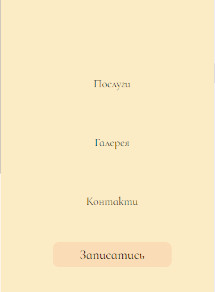
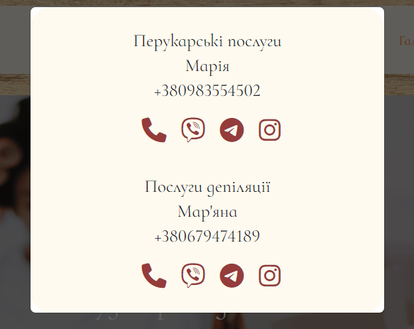
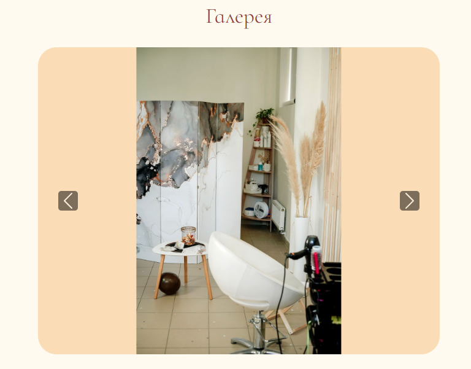
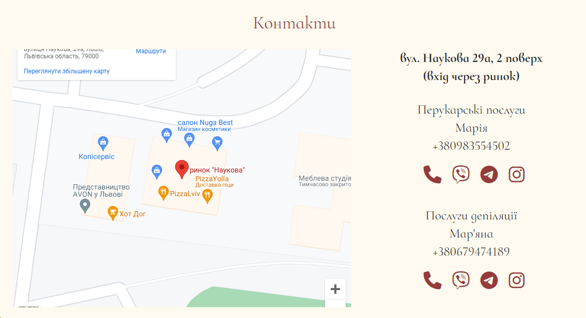

# Beauty Studio (real order)

[Here you can check it](http://beauty-studio.online/)

---

There was no figma design for this project, so all you can see is only my vision.
This landing page is 100% responsive for all types of screens.
I used HTML, CSS, JS in this project.

---

###What was interesting in this project:

1. Customer didn't have any ideas about how this landing page mu look like.

2. Full screen mobile menu, where burger icon slowly changing to X mark.



3. Modal contact menu



3. Few swiper sliders combined on one page.

```
 <script>
      var swiper = new Swiper('.mySwiper', {
        navigation: {
          nextEl: '.swiper-button-next',
          prevEl: '.swiper-button-prev',
        },
        loop: true,
        autoplay: {
          delay: 3000,
        },
      });
    </script>
```



4. Google maps and contacts in one section



---
